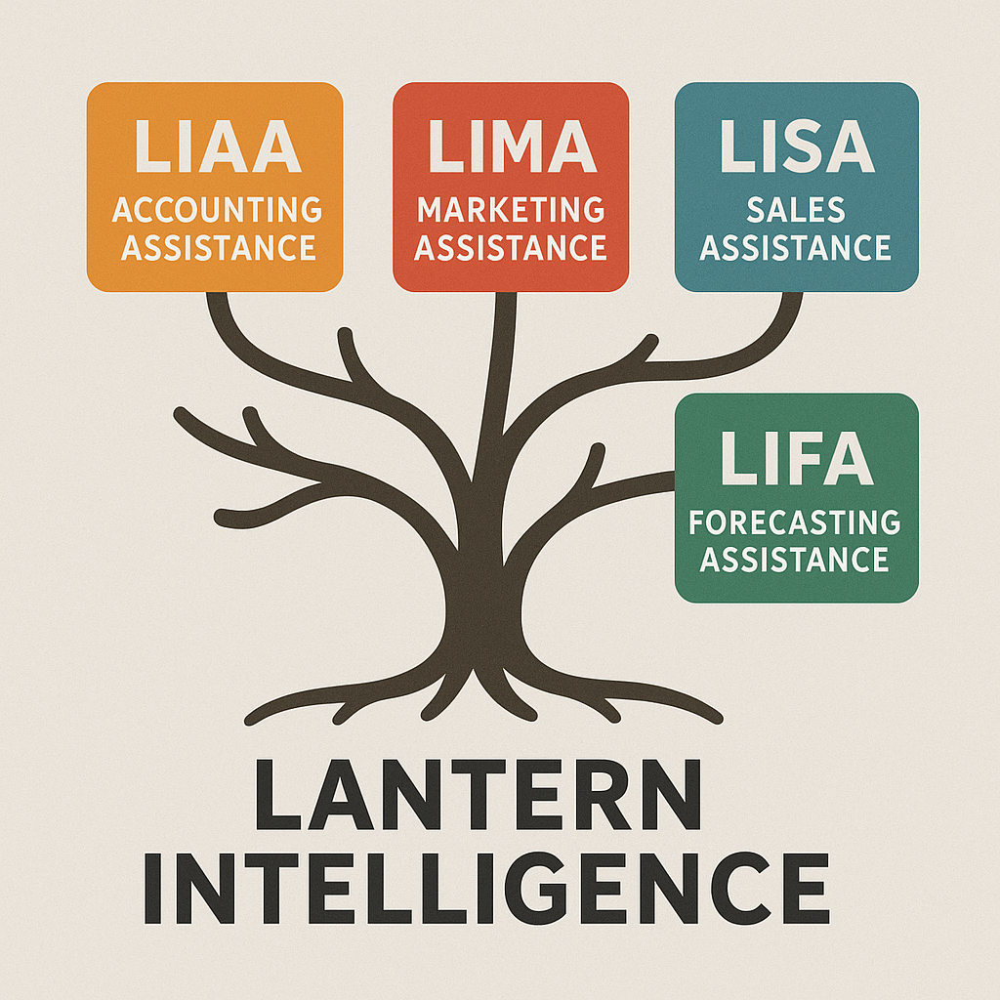
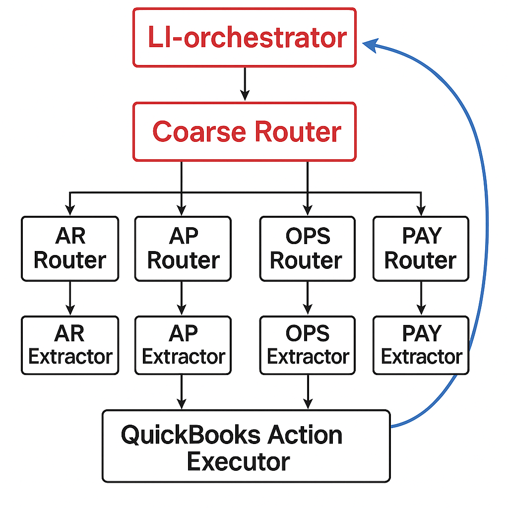

# Lantern Intelligence

Lantern Intelligence is a modular multi-agent AI system designed to automate small business workflows through natural language interaction. The system translates unstructured user prompts into structured, machine-executable actions, with a current focus on accounting automation via the QuickBooks API.

This project was architected and engineered from the ground up as a full-stack machine learning system, combining intent classification, structured information extraction, and real-world API orchestration.

---

## Platform Architecture

Lantern Intelligence is designed as a unified AI platform with multiple specialized branches:

- **LIAA** — Lantern Intelligent Accounting Assistance  
- **LIMA** — Lantern Intelligent Marketing Assistance  
- **LISA** — Lantern Intelligent Sales Assistance  
- **LIFA** — Lantern Intelligent Forecasting Assistance  

Development currently focuses on **LIAA**, the accounting branch.

---

## Accounting System (LIAA) Architecture

The accounting assistant follows a hierarchical multi-agent pipeline:

### Pipeline Overview

1. **LI-Orchestrator (Qwen-7B, LoRA)**  
   Top-level conversational layer responsible for system behavior and dialogue.

2. **Coarse Intent Router (MiniLM)**  
   Classifies incoming prompts into high-level domains:  
   AP, AR, OPS, PAYROLL, UNKNOWN, AMBIGUOUS.

3. **Fine Intent Routers (MiniLM x4)**  
   Domain-specific classifiers that identify fine-grained accounting actions.

4. **Extractor Decoders (Qwen-1.5B x4)**  
   Convert natural language into structured JSON schemas.

5. **Action Executor**  
   Submits validated payloads to the QuickBooks API using OAuth 2.0.

