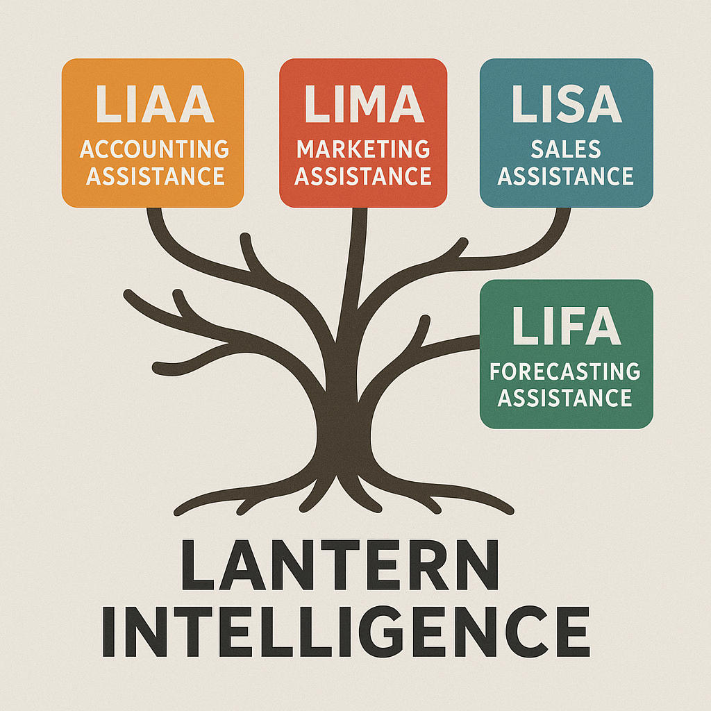
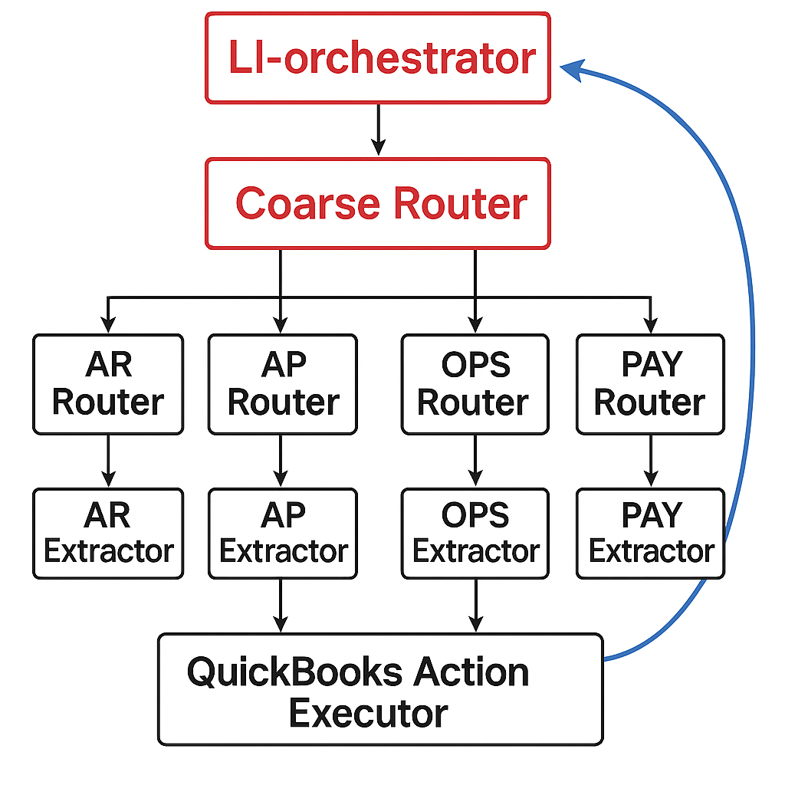

  

# Lantern Intelligence

> A modular AI system evolving from structured action execution to grounded reasoning over real-world data.

Lantern Intelligence is a modular multi-agent AI system designed to automate small business workflows through natural language interaction. The system translates unstructured user prompts into structured, machine-executable actions, with a current focus on accounting automation via the QuickBooks API.

This project was architected and engineered from the ground up as a full-stack machine learning system, combining intent classification, structured information extraction, and real-world API orchestration.

---

## Platform Architecture

Lantern Intelligence is designed as a unified AI platform with multiple specialized branches:

- **LIAA** — Lantern Intelligent Accounting Assistance  
- **LIMA** — Lantern Intelligent Marketing Assistance  
- **LISA** — Lantern Intelligent Sales Assistance  
- **LIFA** — Lantern Intelligent Forecasting Assistance  

  

Development currently focuses on **LIAA**, the accounting branch.

---

## Accounting System (LIAA) Architecture

The accounting assistant follows a hierarchical multi-agent pipeline:

  

### Pipeline Overview

1. **LI-Orchestrator (Qwen-7B, LoRA)**  
   Top-level conversational layer responsible for system behavior and dialogue.

2. **Coarse Intent Router (MiniLM)**  
   Classifies incoming prompts into high-level domains:  
   AP, AR, OPS, PAYROLL, UNKNOWN, AMBIGUOUS.

3. **Fine Intent Routers (MiniLM x4)**  
   Domain-specific classifiers that identify fine-grained accounting actions.

4. **Extractor Decoders (Qwen-1.5B x4)**  
   Convert natural language into structured JSON schemas.

5. **Action Executor**  
   Submits validated payloads to the QuickBooks API using OAuth 2.0.

---

# 🚀 Lantern Intelligence v2 — Reasoning & Retrieval Architecture

Lantern Intelligence v2 extends the platform beyond action execution into **grounded reasoning over financial data**.

While V1 focuses on translating natural language into executable actions, V2 introduces a structured pipeline that combines:

- live company data (SQL)  
- financial knowledge (ChromaDB)  
- controlled LLM reasoning (Ollama)  

The result is a system capable of producing **context-aware, data-grounded financial analysis**.

---

## V2 System Architecture
User Question
↓
Query Router
↓
Retrieval Layer
├── SQL (Live Financial Data)
└── ChromaDB (Concept Knowledge)
↓
Prompt Builder
↓
LLM (Ollama — llama3.1:8b)
↓
Streaming Response (CLI / Web)

---

## Pipeline Components

### Query Router (`query_router.py`)
- Lightweight keyword-based routing  
- Selects only relevant financial queries  
- Reduces noise before retrieval  

---

### Retrieval Layer (`retrieve.py`)
- Executes SQL queries on company databases  
- Retrieves relevant concept documents from ChromaDB  
- Returns structured context for reasoning  

---

### Knowledge Base + Embeddings (`ingest.py`)
- Financial concepts stored as `.txt` documents  
- Embedded using SentenceTransformers  
- Persisted in ChromaDB for semantic retrieval  

---

### Prompt Builder + Adviser (`adviser.py`)
- Constructs structured prompts with:
  - strict system rules (no hallucination)  
  - financial benchmarks  
  - live company data  
- Calls local LLM (Ollama)  
- Streams responses in real time  

---

### Interfaces

#### CLI (`main.py`)
- Interactive question-answer loop  
- Multi-company selection  

#### Web (`app.py`)
- FastAPI backend  
- Streaming responses  
- Supports conversational context  

---

## Key Design Principles

- **Grounded Reasoning**  
  The LLM is constrained to use only retrieved data and concepts  

- **Separation of Concerns**  
  Retrieval, routing, and reasoning are independent modules  

- **Local-First Inference**  
  Runs entirely on local infrastructure (Ollama)  

- **Hybrid Intelligence**  
  Combines:
  - structured data (SQL)  
  - semantic retrieval (ChromaDB)  
  - generative reasoning (LLM)  

---

## Evolution from v1

| v1 | v2 |
|----|----|
| Action execution | Reasoning over data |
| API orchestration | Retrieval-Augmented Generation (RAG) |
| Structured outputs | Context-aware analysis |
| Task automation | Decision support |

> v1 executes actions.  
> v2 reasons over data.
